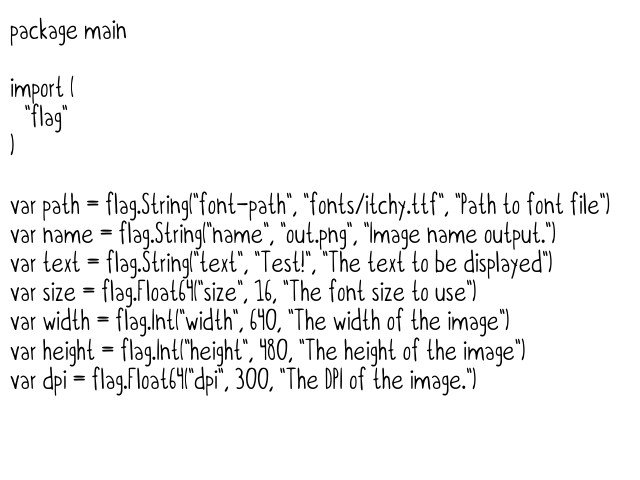

# imgmk

A simple CLI tool to make images with fonts and text.

## Usage

There are a number of flags that you can use to make imgmk work for you the way you want it to. You can either pipe in text via a unix pipe or use the pipe flag.

### Text Via Flag

```bash
./imgmk -text="This is a test"
```

That command above created this image:


### Text Via Pipe

```bash
cat flags.go | ./imgmk -size=7
```

That command above created this image:



### Other Flags

You can specify other things via flags!

#### Path

You can specify the path to a ttf file. Right now it has to be a ttf file.

```bash
-path="/path/to/the/file.ttf"
```

#### Name

You can specify the output file name.

```bash
-name="out.png"
```

#### Text

As you saw above, you can specify the text.

```bash
-text="Test"
```

#### Size

You can also specify the font-size.

```bash
-size=16
```

#### Width

And the image width.

```bash
-width=640
```

#### Height

And the image height.

```bash
-height=480
```

#### DPI

And the DPI!

```bash
-dpi=300
```

#### Transparent

If you want the background to be transparent instead of white, pass the transparent flag.

```bash
-transparent
```

This image below was generated with the following:

```bash
./imgmk -transparent -width=200 -height=100
```


